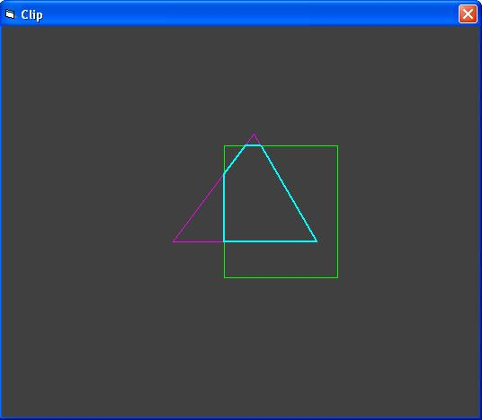



## EGL\_Clipping

### Description

Rectangle and triangle intersections and clipping. This project contains canvas and face clip operations for 3D programming. Delaunay triangulations algorithm not used. Simple and fast.

Add Bonus Project: Angle
 
### More Info
 

             |
---                |---
**Submitted On**   |2011-04-01 19:51:48
**By**             |[Erkan Sanli](https://github.com/Planet-Source-Code/PSCIndex/blob/master/ByAuthor/erkan-sanli.md)
**Level**          |Beginner
**User Rating**    |5.0 (25 globes from 5 users)
**Compatibility**  |VB 4\.0 \(32\-bit\), VB 5\.0, VB 6\.0
**Category**       |[Graphics](https://github.com/Planet-Source-Code/PSCIndex/blob/master/ByCategory/graphics__1-46.md)
**World**          |[Visual Basic](https://github.com/Planet-Source-Code/PSCIndex/blob/master/ByWorld/visual-basic.md)
**Archive File**   |[EGL\_Clippi220122432011\.zip](https://github.com/Planet-Source-Code/erkan-sanli-egl-clipping__1-73839/archive/master.zip)

